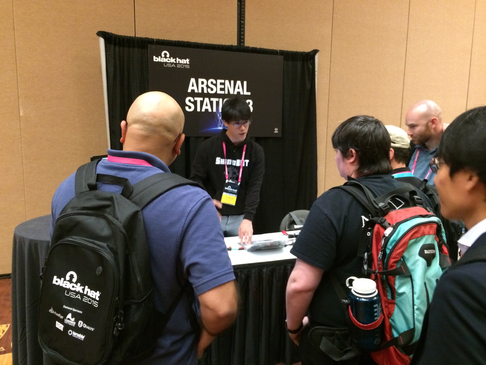
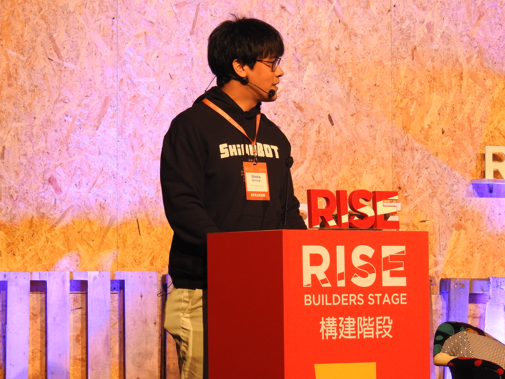
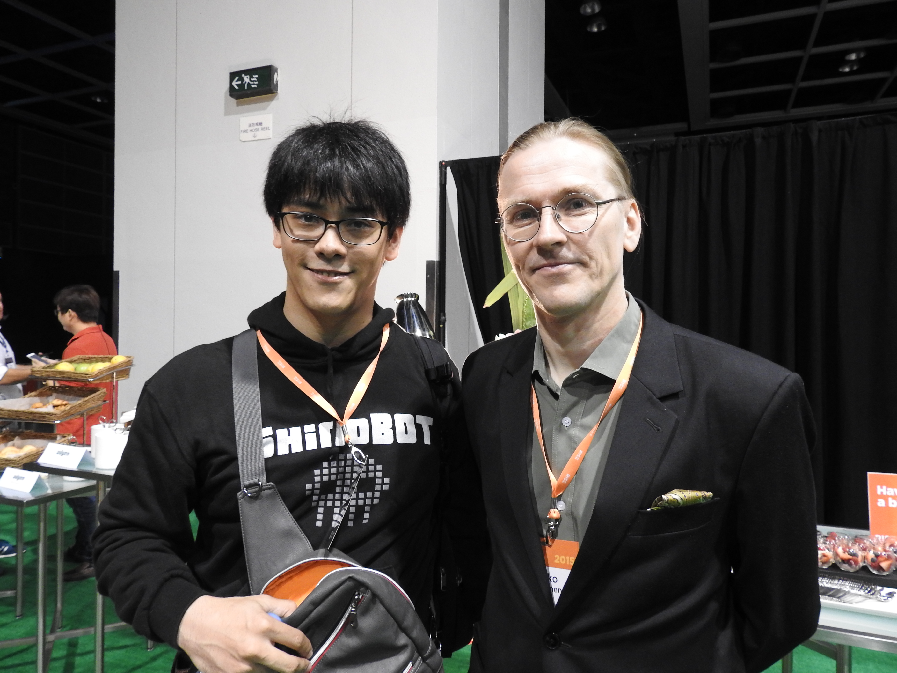
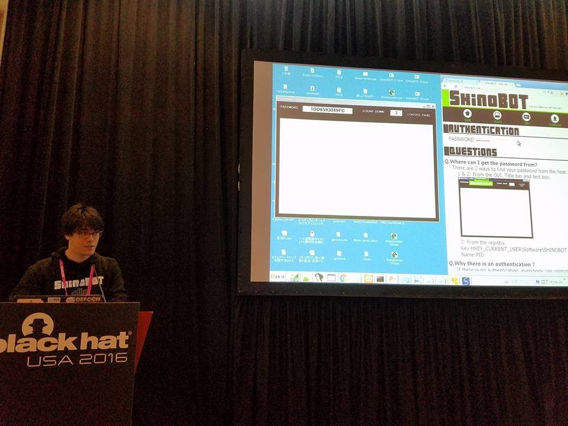
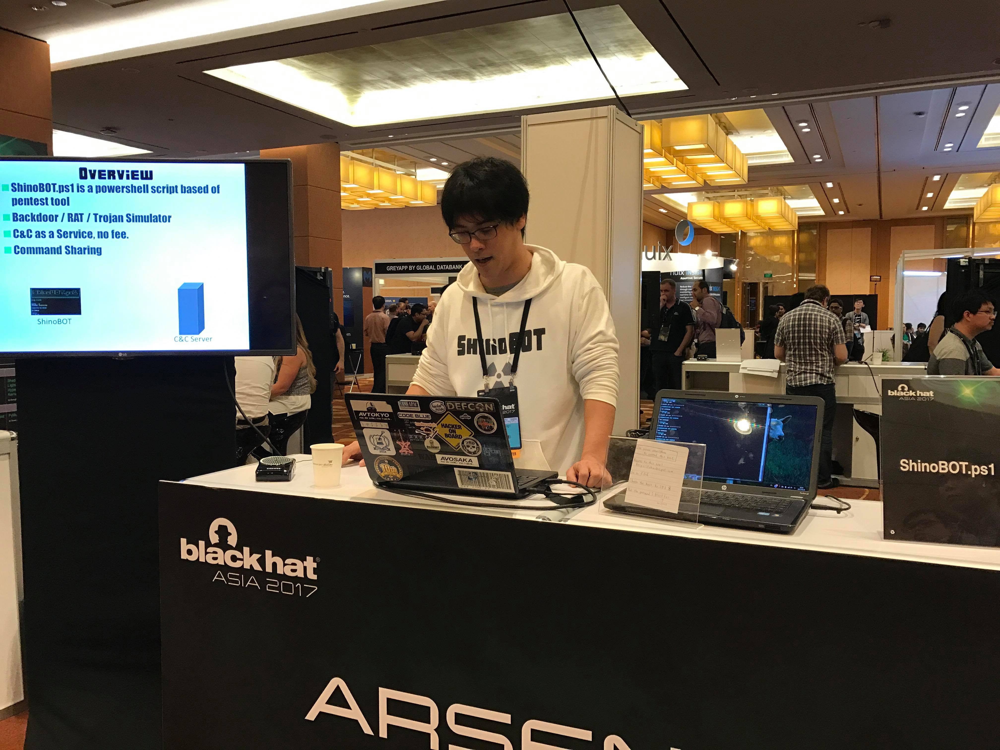
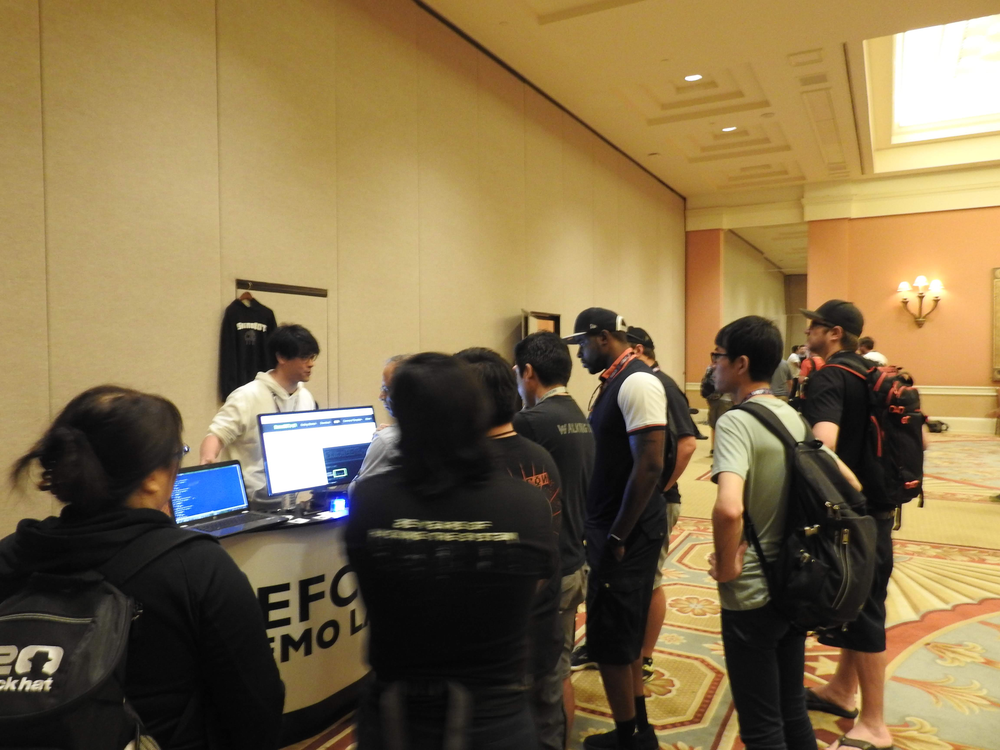
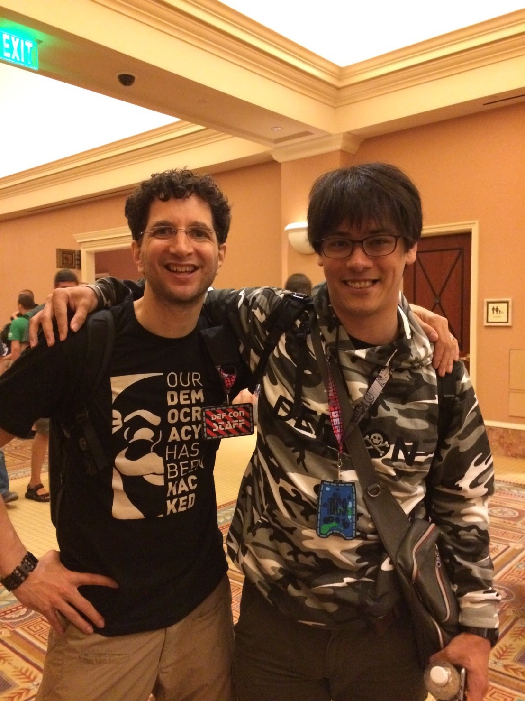
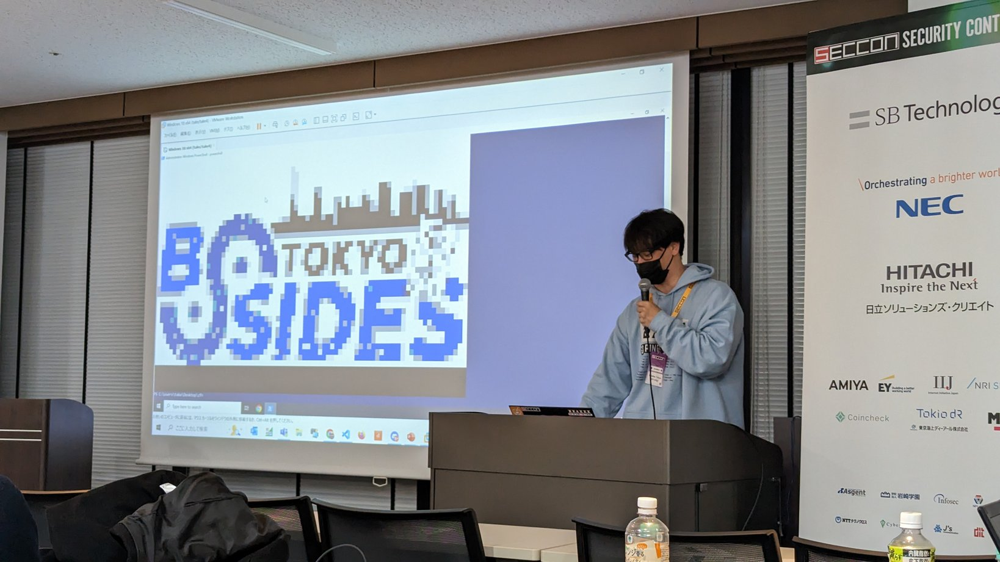
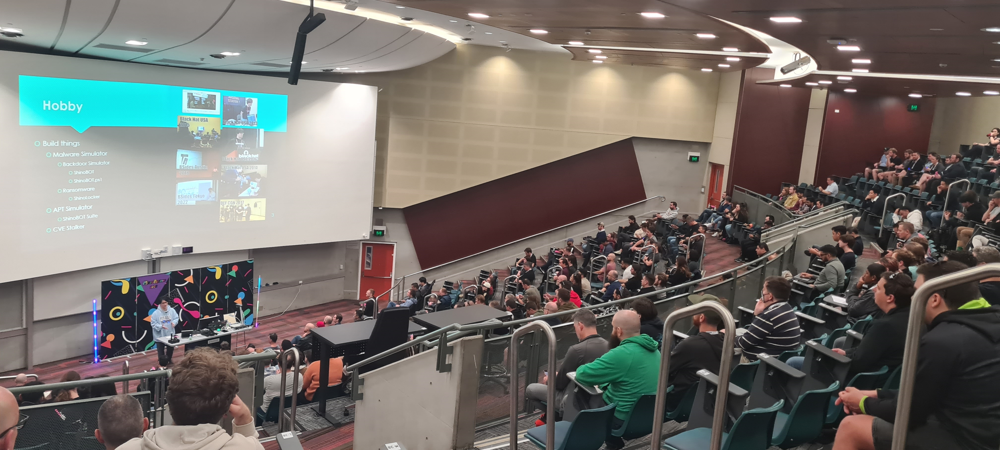

# Shota Shinogi (Sh1n0g1)
* 🥼cyber security researcher
* ⚔️pentester
* ⌨️pentest tool author
* 👨‍⚖️CTF organizer
* Born in France🥖🥐
* Raised in Japan⛩️🗼
* Flying around the world🛫🌍

# Projects 
## Malware Simulator for Testing Purpose
* [ShinoBOT](https://shinosec.com)👿Backdoor simulator(exe)
* [ShinoBOT.ps1](https://shinobotps1.com)😈Backdoor simulator(ps1) 
* [ShinoBOT Suite](https://shinosec.com/shinobotsuite/)💀APT simulator 
* [ShinoLocker](https://shinolocker.com/)🔒Ransomware simulator 

## CTF (sponsored by Macnica Inc)
* 🏁[MNCTF](https://mnctf.info/) (Japanese)
  * Permanent CTF for beginners and professionals

## AI Related Project
* 🎞️[YouTube Summarizer](https://gist.github.com/Sh1n0g1/d69db6dbc5c13ce887c23c6828658570) Google Colab + LangChain + OpenAI API
* 📄[Document QA ShinoLang](https://gist.github.com/Sh1n0g1/eee5daef2ab9dacc14348c095620630e) (Japanese)Google Colab + LangChain + OpenAI API
* 📰[Matomeru-kun](https://matomerukun.shino.club/) (Japanese) News Summary Powered By ChatGPT

## Misc
* 🔍[Z9 PowerShell Analyzer](https://z9.shino.club/) Malicious PowerShell Script Analyzer
* 🕳️[CVEStalker](https://cvestalker.com/) Vulnerability(CVE) Billboard
* 🧪[PowerShell Lab](https://shino.club/powershelllab/) Play with PS
* 👀[ShinoVis](https://shino.club/shinovis/) Network Graph Generator
* 🖼️[AES ECB Image Decryptor](https://shino.club/aesecbdecryptor/) AES ECB Online Image Decryptor

# Communities
* 🥚[CyberTamago](https://cybertamago.org/)
  * A community for the open-source developers
  * If you have a tools you want to list up on the website, please contact me

* 🚢[HamaSec](https://hamasec.connpass.com/)
  * A local cybersecurity community for Yokohama city.

# Talks
* [Black Hat USA 2013 Arsenal](https://www.blackhat.com/us-13/arsenal.html#Shinogi)
* [Black Hat USA 2014 Arsenal](https://www.blackhat.com/us-14/arsenal.html#Shinogi)
* [Black Hat Asia 2015 Arsenal](https://www.blackhat.com/asia-15/arsenal.html#Shinogi)
* [Black Hat USA 2015 Arsenal](https://www.blackhat.com/us-15/arsenal.html#shota-shinogi)
* RISEconf 2015
* [Black Hat USA 2016 Arsenal](https://www.blackhat.com/us-16/arsenal.html#shota-shinogi)
* [Black Hat Asia 2017 Arsenal](https://www.blackhat.com/asia-17/arsenal/schedule/#shinobotps1-5885)
* [DEFCON 25 Demolabs](https://defcon.org/html/defcon-25/dc-25-demolabs.html#ShinoBOT)
* [BSides Austin 2018](https://bsidesaustin2018.sched.com/shota_shinogi.6z7mdw9)
* [Bsides Tokyo 2023](https://bsides.tokyo/2023/index.html)
* [BSides Brisbane 2023](https://bsidesbrisbane.com/schedule/)
* [Black Hat USA 2023 Arsenal](https://www.blackhat.com/us-23/arsenal/schedule/presenters.html#shota-shinogi-31941)
* [Black Hat MEA 2023 Arsenal](https://www.blackhat.com/us-23/arsenal/schedule/presenters.html#shota-shinogi-31941)

# Trainings (joined as a trainer)
* Security Camp 2015, 2016, 2017, 2018, 2019, 2020, 2021, 2022
* [Global Cybersecurity Camp 2023](https://gcc.ac/gcc_2023/)
    * I got inverviewed about my session "PowerShell Malware", and it is on YouTube
    
* [Global Cybersecurity Camp 2024](https://gcc.ac/gcc_2024/)

# SNS
* ✖[(X)Twitter](https://twitter.com/Sh1n0g1/)
* 🔗[LinkedIn](https://www.linkedin.com/in/shota-shinogi/)
* ☕[Buy me a coffee](https://buymeacoffee.com/Sh1n0g1)

# Photos

